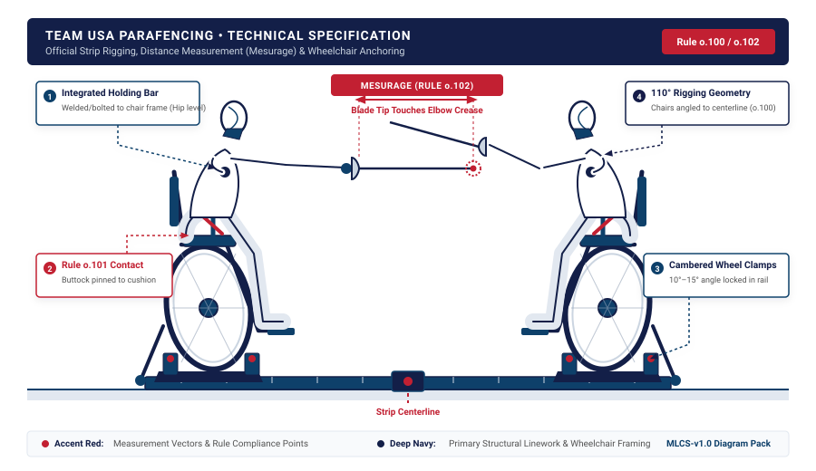
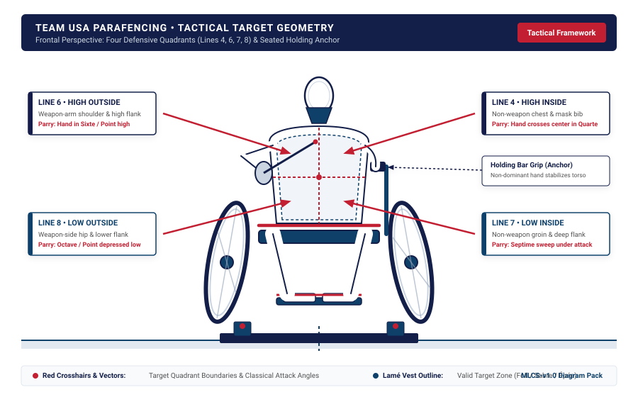

# Parafencing Modular Lesson Card Factory

[](https://colab.research.google.com/github/P4P-Parafencing-4-Progress/parafencing-modular-card-factory/blob/main/Parafencing_Modular_Card_Factory.ipynb)
[](./LICENSE)
[](#6-design-system--tokens)
[](#7-pre-flight-qa-audit-glbl-sop-045)
[](#7-pre-flight-qa-audit-glbl-sop-045)

A deterministic typesetting, live authoring, and multi-format export engine for wheelchair fencing coaches, training partners, and national team staff. 

It transforms technical parafencing drills into standardized, print-ready **5x7 inch double-sided cards** with zero text drift, zero orphan words, and zero layout overflow.

---

## 1. The Core Problem & The Solution

Packaging technical sports knowledge into reliable physical cards is notoriously fragile:
* **The Layout Defect Problem**: Text drifts unpredictably across pages, single-word orphan lines clutter list items, and expanding evaluation text cuts off card footers.
* **The Cartoon Distortion Problem**: Generic AI tools generate whimsical cartoon clip-art that misrepresents wheel camber, grip angle, frame clamping, and Rule o.102 *mesurage*.
* **The Training Partner Gap**: Over 85% of wheelchair fencers train in local clubs where a certified handisport master is not present daily. Able-bodied training partners (*partenaires valides*) need exact, standardized tactile cues so they do not corrupt the wheelchair fencer's spatial schema.

**The Solution**: A closed-loop, deterministic pipeline built in Google Colab. It pairs pure Python typographic rules with exact 5x7 inch CSS print contracts, publication-grade vector schematics, and the classical French master *Fiche Pédagogique* standard.

---

## 2. Pedagogy & Sports Science Foundations

This factory is grounded in two rigorous frameworks:

### A. The French DTN Fiche Pédagogique Standard
In French master training at INSEP and the Fédération Française Handisport (pioneered by Maître Christian Aubailly), drill cards are structured as invariant behavioral contracts:
1. **Situation d'Apprentissage**: Strict spatial setup, category context (Category A or B), and Rule o.102 distance.
2. **Objectif Opérationnel**: Observable motor execution under explicit timing constraints.
3. **Rôle du Plastron / Partenaire**: Exact distance, blade line, and tactile cues presented by the coach or training partner.
4. **Comportement de l'Élève**: Motor execution response.
5. **Critères de Réussite & Auto-Évaluation**: Objective athlete self-audit metrics.
6. **Variables Didactiques**: Controlled levers to scale complexity without compromising mechanical alignment.

### B. Économie de Mots & The Token Economy
In seated fencing, reaction times are 150 to 300 milliseconds. Excessive verbal explanation during a drill creates cognitive interference. 
* **Économie de mots**: High-information, single-syllable operational cues (*"Fer!"*, *"Sixte!"*, *"Bras!"*, *"Prêt"*).
* **The Token Economy**: Each section on the 5x7 card has a strict character budget. The card sets the boundary, the cue triggers the action, and the athlete self-audits immediately.

---

## 3. Card Structure (Side A & Side B)

Each card is a double-sided 5x7 inch operational unit:

| Side | Operational Role | Key Sections |
|---|---|---|
| **Side A** | **Instruction & Biomechanics** | Category Badge (`A` or `B`), Module Code, Drill Title, Tactical Phase, Equipment, Setup & Execution Steps, Technical Vector Schematic. |
| **Side B** | **Dual-Track Evaluation & Audit** | Header Badge, Coach Evaluation Cues (tactile/visual triggers for coach & sparring partner), Athlete Self-Audit (closed-loop reflection questions). |

---

## 4. Examples of Output Deliverables

All deliverables are generated in dual format:

### A. Print-Ready PDF Decks (5x7 Inches)
* **[USOPC Light Toner-Saver Deck (PDF)](./examples/parafencing_cards_usopc_light.pdf)**: High-contrast white background engineered for physical printing, camp binders, and trackside lamination.
* **[Mobile Dark Trackside Deck (PDF)](./examples/parafencing_cards_mobile_dark.pdf)**: Deep USA Fencing Navy palette optimized for handheld iPad and phone review trackside.

### B. Interactive HTML Decks with Live Action Toolbar
* **[Interactive Light Deck (HTML)](./examples/parafencing_cards_usopc_light.html)**
* **[Interactive Dark Deck (HTML)](./examples/parafencing_cards_mobile_dark.html)**

Each HTML deck includes a sticky top toolbar:
* **`🖨️ Save as PDF`**: Triggers native browser print pre-configured for 5x7 inches borderless.
* **`📸 Save PNGs`**: Uses embedded canvas rendering to export 300 DPI PNG cards directly to your Downloads folder.
* **`✏️ Edit Mode`**: Toggles live in-browser editing so coaches can customize cues right on the card before exporting.
* **`⬇️ Save HTML`**: Downloads the customized HTML file with edits preserved.

### C. Clinical Vector Technical Schematics
Mechanical line diagrams depicting exact competition standards:

| Saint-Hilaire Frame Rigging (Rule o.102) | Seated Target Quadrants & Classical Lines |
|:---:|:---:|
|  |  |

---

## 5. How to Run in 1 Click

### Option 1: Run in Google Colab (Zero Installation)
1. Click the **[Open in Colab](https://colab.research.google.com/github/P4P-Parafencing-4-Progress/parafencing-modular-card-factory/blob/main/Parafencing_Modular_Card_Factory.ipynb)** badge.
2. Select `Runtime` -> `Run all`.
3. In **Stage 3**, choose a drill preset (`M1-01: Rigging`, `M1-02: Target Quadrants`, or `Custom`).
4. In **Stage 6**, Cell `## 6.4 One-Click Package Downloader` automatically creates `parafencing_cards_complete_pack.zip` and triggers an immediate browser download containing all HTML, PDF, PNG, and audit files.

### Option 2: Run Locally
```bash
git clone https://github.com/P4P-Parafencing-4-Progress/parafencing-modular-card-factory.git
cd parafencing-modular-card-factory
pip install playwright jinja2
playwright install chromium
```
Open `Parafencing_Modular_Card_Factory.ipynb` in VS Code or JupyterLab and execute all cells.

---

## 6. Design System & Tokens

| Token | Hex Value | Purpose |
|---|---|---|
| **USA Fencing Navy** | `#131F48` | Primary surface, headers, Dark Deck background |
| **Accent Red** | `#C22032` | Critical cues, tactical attack vectors, warnings |
| **Supporting Blue** | `#0E406A` | Subsections, borders, secondary badges |
| **Neutral Gray** | `#A7A9AC` | Technical lines, secondary metadata, dividers |
| **Paper White** | `#FFFFFF` | Light deck surface, high-contrast text |
| **Card Dimensions** | `5in x 7in` | Exact physical card format (1500 x 2100 px at 300 DPI) |
| **Margins / Padding** | `0.22in / 0.26in` | Perimeter boundary preventing printer cutoff |

---

## 7. Pre-Flight QA Audit (`GLBL-SOP-045`)

This repository is validated against the 10 quality gates of `GLBL-SOP-045`:

```text
[PASS] QA-01: Topology Structure           | 20 Markdown / 13 Code cells.
[PASS] QA-02: Two-Tier Folding             | 7 Top Sections (#) and 13 Subsections (##) found.
[PASS] QA-03: Dual-Interface Cards         | Code cells cleanly paired with explanatory markdown cards.
[PASS] QA-04: Cell 0 AI Prompt Contract    | Mandatory side-panel governing prompt verified.
[PASS] QA-05: Zero-Stub Execution Check    | All code cells contain real logic and operations.
[PASS] QA-06: Variable Ingestion Triad     | Parameters externalized via Colab Forms and/or Sheets.
[PASS] QA-07: Failure Isolation Gates      | Auxiliary and cloud steps wrapped in isolated try/except handlers.
[PASS] QA-08: Deterministic Logic          | All arithmetic and structural contracts executed in Python.
[PASS] QA-09: Subfolder & Markdown Docs    | Dedicated folder with companion README.md and Drive links.
--------------------------------------------------------------------------------
VERDICT: 100% PASS - Satisfies GLBL-SOP-045, BAZA-PRTCL-009, and Dual-Interface standard.
```

---

## 8. Directory Structure

```text
parafencing-modular-card-factory/
├── Parafencing_Modular_Card_Factory.ipynb   # Canonical Colab notebook
├── README.md                                 # Master documentation
├── LICENSE                                   # MIT License
├── .gitignore                                # Python/Jupyter ignore rules
├── assets/                                   # Technical vector schematics
│   ├── parafencing_frame_setup_diagram.svg
│   └── parafencing_target_quadrants_diagram.svg
└── examples/                                 # Compiled sample deliverables
    ├── parafencing_cards_usopc_light.pdf    # 5x7 print-ready PDF (Light)
    ├── parafencing_cards_mobile_dark.pdf    # 5x7 mobile PDF (Dark)
    ├── parafencing_cards_usopc_light.html   # Standalone HTML with toolbar
    └── parafencing_cards_mobile_dark.html   # Standalone HTML with toolbar
```

---

## 9. Governance, Pedagogical Lineage & Academic Attribution

This project does not claim original authorship of the underlying fencing pedagogy. The pedagogical architecture and drill structure of these modular cards are grounded directly in decades of empirical research and coaching education developed by French fencing masters, biomechanists, and national sports science institutions:

### Primary Research Lineage & Pedagogical Sources
* **Direction Technique Nationale (DTN): Fédération Française Handisport (FFH) & Fédération Française d\'Escrime (FFE)**:
  * The formal *Fiche Pédagogique* (Pedagogical Drill Card) architecture, establishing the 6 invariant sections: *Situation d\'Apprentissage*, *Objectif Opérationnel*, *Rôle du Plastron*, *Comportement de l\'Élève*, *Critères de Réussite & Auto-Évaluation*, and *Variables Didactiques*.
  * *Mallette Pédagogique Handisport*: Standardized instructional frameworks developed specifically for wheelchair fencers training in mainstream clubs with able-bodied sparring partners (*partenaires valides*).
* **Maître Christian Aubailly**:
  * Pioneer of modern wheelchair fencing pedagogy and biomechanics. His seminal manuals, federal coaching guides, and research codified fixed-frame distance (*mesurage*), non-weapon arm bracing mechanics, and blade alignment from a stationary chassis.
* **Institut National du Sport, de l\'Expertise et de la Performance (INSEP) & CREPS de Châtenay-Malabry**:
  * Neuromuscular reaction time studies (150-300ms execution windows), motor learning papers, and sports psychology research establishing the principle of *Économie de mots* (verbal economy) to eliminate cognitive interference during motor skill acquisition.
* **Classical French Fencing Lineage (Camille Prévost, Louis Rondelle)**:
  * Historical foundation for clinical, anatomical line analysis and the strict rejection of caricature or decorative distortion in technical fencing treatises.

### Systems Architecture, Packaging & Implementation
* **Architectural Integration & Adaptation**: Kamilla Gafurzianova (Olympic Silver Medalist, 25+ years fencing lineage)
* **Organization & Mission**: P4P: Parafencing 4 Progress
* **Automation & Typesetting Engine**: BAZA Architecture, Phrase Protocol (BAZA-PROTOCOL-FENCING-001), and Colab Sequential Topology (BAZA-PRTCL-009 v1.2)
